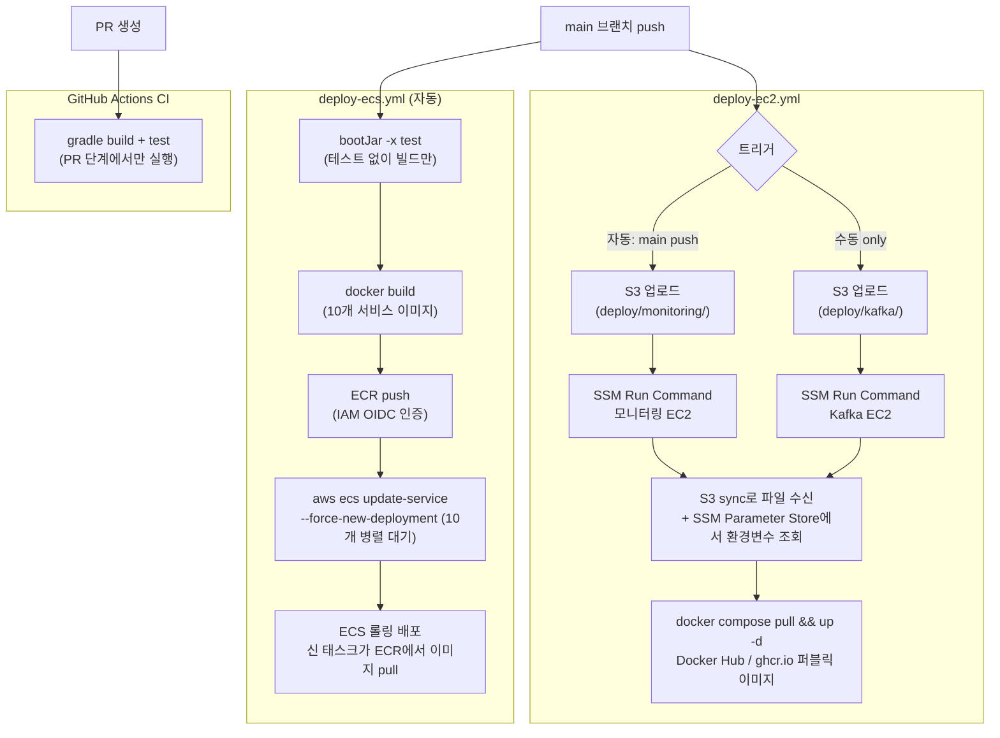

# 인프라 설계 및 의사결정 문서

# [1] 개요

## SLO (성능 목표)

목표 수치는 부하테스트로 정하는 것이 아니라, 근거를 들어 먼저 정해두고 부하테스트로 검증하고 조정합니다. 10만 CCU / 5,000 TPS는 MVP에서 달성할 수치가 아니라 최종 비전입니다. MVP는 정합성 검증이 가능한 작은 규모부터 시작합니다.

| 구분 | 목표 수치 | 목적 | 인프라 구성 |
| --- | --- | --- | --- |
| **MVP 검증 목표** | • CCU 1만~2만, 단일 경매 TPS 500~1,000, 입찰 API 응답 1~3초<br>• WS 브로드캐스트 1초<br>• 비동기 후처리 5~30초 허용, 정합성 오류 0건<br>• 5xx 에러율 0.1% 이하<br>• 입찰 실패율 1% 이하 | Redis 원자 처리와 최고가 정합성 검증 | ALB, 단일 RDS, 단일 Kafka (SPOF는 명시적으로 감수) |
| **최종 운영 목표(비전)** | CCU 10만+, TPS 5,000(피크) | 고도화 로드맵의 종착점 | Kafka 다중화 |

**두 목표의 관계**: MVP에서 정합성을 통과한 뒤, 막힌 곳부터 늘려 최종 목표로 확장합니다.

**각 MVP 수치의 산정 근거**

| 항목 | 값 | 근거 |
| --- | --- | --- |
| CCU | 1만~2만 | 정합성 검증이 가능한 최소 규모이자 최종 목표(10만)의 10~20% 수준. 점진 확장의 출발점 |
| 단일 경매 TPS | 500~1,000 | 단일 경매에 입찰이 직렬화되는 구조에서 락과 원자 처리의 정합성을 흔들어볼 수 있는 동시 쓰기 수준 |
| 입찰 API 응답시간 | 1~3초 | 동기 요청·응답 구간, 사용자가 직접 기다리는 시간 |
| WS 브로드캐스트 | 1초 | 입찰 성공 후 전체 참여자에게 최고가를 전파하는 시간 |
| 비동기 후처리 | 5~30초 허용 | Kafka 경유 DB 적재·알림 등 백그라운드 처리 |
| 정합성 오류 | 0건 | 동시 입찰에서 최고가가 단 한 건도 꼬이지 않아야 함 |
| 5xx 에러율 | 0.1% 이하 | 시스템 에러 허용 상한 |
| 입찰 실패율 | 1% 이하 | 정합성이 핵심이므로 실패 허용폭을 좁게 둠 |

## CCU와 TPS는 서로 다른 문제

| 문제 | 기준 | 영향 |
| --- | --- | --- |
| **10만 CCU (연결 수용)** | 연결을 몇 개나 열고 유지하나 | 서버 대수, 메모리, 소켓/포트 |
| **5,000 TPS (단일 경매 쓰기)** | 한 경매 키에 입찰을 얼마나 빨리 반영하나 | 처리 로직 구조 |

**왜 TPS는 서버를 늘려도 안 풀리나**: 같은 경매 입찰은 결국 한 지점에서 직렬화되기 때문입니다. 그래서 "입찰서버를 N대로 늘린다"는 CCU 대책이지 단일 경매 TPS 대책이 아닙니다. MVP의 TPS 목표(500~1,000)도 처리량 자랑이 아니라 직렬화 구간에서 최고가가 꼬이지 않는지를 보는 정합성 검증이 진짜 목적입니다.

## MVP → 고도화 로드맵

현재 단일 구성의 SPOF는 MVP 단계에서 의도적으로 감수합니다. 이중화는 부하테스트에서 병목이 확인되는 항목부터 단계적으로 도입합니다.

| 단계 | 로드밸런서 | 메시지 | 네트워크 |
| --- | --- | --- | --- |
| **MVP** | ALB 단독 | Kafka 단일 | NAT 제거(Public Subnet) |
| **고도화** | (유지) | Kafka 다중 | (필요 시 재검토) |

**고도화 진입 순서와 트리거**

| 순서 | 항목 | 진입 트리거(부하테스트 결과) |
| --- | --- | --- |
| 1 | Kafka 다중 | 단일 브로커 처리량 또는 SPOF가 문제될 때 |
| 2 | 읽기 복제본 | DB 커넥션/읽기 부하가 병목으로 확인될 때 |

---

# [2] 부하테스트 계획

**목적**: 단순 부하 측정이 아니라 정합성 검증입니다. 최고가가 꼬이지 않는지를 먼저 통과한 뒤에 수치를 올립니다.

## 단계 설계

| 단계 | 무엇을 보나 | 규모 | 통과 기준 |
| --- | --- | --- | --- |
| 1 | Redis 원자 처리, 최고가 꼬임 검증 | 소규모(정합성만) | 동시 입찰에서 최고가가 단 한 번도 꼬이지 않음 |
| 2 | MVP 목표까지 부하 상향 | CCU 1만~2만, TPS 500~1,000 | 정합성 오류 0건, 5xx 에러율 0.1% 이하, 입찰 실패율 1% 이하 |
| 3 | 병목 지점 측정 | 막힐 때까지 | bid CPU / Kafka / RDS 커넥션 / Redisson 락 중 어디가 먼저 막히는지 수치화 |

**정합성 통과가 선행 조건**: 1단계에서 최고가가 꼬이면 수치를 올리지 않습니다. 정합성을 통과해야 2단계 부하 상향으로 넘어갑니다.

3단계에서 가장 먼저 막히는 지점이 고도화 로드맵([1])의 진입 트리거가 됩니다.

## 부하 발생기 구성

JMeter는 테스트 대상 서버 바깥에서 가짜 요청과 연결을 대량으로 만드는 도구입니다. 발생기 규모도 측정 전에 미리 정합니다.

- 로컬 한 대로는 1만~2만 동시 WebSocket 연결을 만들 수 없습니다(포트, 메모리 한계).
- 같은 AWS 리전에 부하 발생용 EC2 여러 대를 두는 분산 모드로 목표 연결 수를 나눕니다.
- 발생기 1대당 가용 연결 수를 근거로 대수를 미리 산정합니다. 한 인스턴스의 포트 한계가 약 6.4만이지만 안전하게 1만 내외/대로 잡으면, 2만 연결에 발생기 2~3대가 필요합니다.
- 사전 소규모 측정으로 1대당 실제 발생 가능 연결 수를 보정합니다.
- **왜 굳이 EC2에 올려서 하나요?** 외부 인터넷에서 쏘면 발생기의 네트워크가 병목이 되어 서버가 아닌 발생기 한계를 재게 됩니다. 그래서 같은 리전 안에서 발생시킵니다.

## 측정 환경 기록

매 측정마다 아래를 기록해 결과를 재현 가능하게 합니다.

| 항목 | 기록 내용 |
| --- | --- |
| 대상 서버 | bid 태스크 수, 사양(vCPU/메모리) |
| 부하 발생기 | 인스턴스 타입, 대수, 분산 구성 |
| 데이터 위치 | RDS, Kafka, Redis의 위치와 사양 |
| 목표/결과 | 목표 수치 대비 실측 TPS, 응답시간, 에러율 |

---

# [3] 네트워크

## 의사결정: 로드밸런서 (Nginx vs ALB) ✅

**결론: MVP부터 ALB 단독 사용**

| 선택지 | 개념 | 장점 | 단점 |
| --- | --- | --- | --- |
| Nginx 1대 | Fargate 위 컨테이너 리버스 프록시 | 설정 파일로 세밀한 라우팅 제어, 오픈소스 | 직접 관리, SPOF, Fargate $66/월 |
| Nginx 2대 + ALB ❌ | ALB가 두 Nginx로 분산 | SPOF 해소 | L7 라우팅 이중 중복, 구성 복잡, 비용 높음 |
| **ALB 단독** ✅ | AWS 관리형 L7 LB | WS 기본 지원, 자체 DNS, 관리형 이중화, ~$25/월 | LCU 변동 과금 |
| NLB ❌ | AWS 관리형 L4 LB | 초고성능, IP 접속 가능 | L7 라우팅 없음, 별도 라우팅 레이어 필요 |

**4기준 평가**

| 기준 | Nginx 1대 | Nginx 2대 + ALB | ALB 단독 | NLB |
| --- | --- | --- | --- | --- |
| 비용 | Fargate $66/월 | Fargate 2대 + ALB | ~$25/월 (가장 저렴) | 시간 + 처리량 과금 |
| 트래픽 규모 | 수직 확장, SPOF | SPOF 없음 | 자동 확장 | 매우 높음 |
| 운영 난이도 | 직접 설정 필요 | 높음 | 낮음 (관리형) | 낮음, L7 부재 |
| 확장성 | 수직 확장만 | ALB 도입 시 이중화 | 자동 | 자동 |

비용, 운영 난이도, 확장성 모든 기준에서 ALB 단독이 우위입니다. 초기에는 ALB 사용에 도메인 네임(Route 53) 설정이 필수적이라고 잘못 이해해서 Nginx를 선택했지만, 실제로는 ALB를 생성하면 `://amazonaws.com` 형태의 기본 DNS 도메인이 AWS에서 자동으로 생성되기 때문에 ALB 대신 Nginx를 선택할 근거가 약해졌습니다.

**미채택**

- **Nginx 1대**: 비용($66/월)이 ALB보다 비싸고, SPOF가 존재하며, 직접 관리 부담이 있습니다.
- **Nginx 2대 + ALB**: ALB가 L7 라우팅과 WS 프록시를 모두 대체하므로 그 뒤에 Nginx를 둘 이유가 없습니다.
- **NLB**: L7 라우팅이 없어 경로 분기를 따로 구성해야 합니다. 현 요건에 이점이 없습니다.

## 의사결정: AZ 구성 ✅

**결론: 단일 AZ로 운영합니다.**
멀티 AZ는 AZ 장애 시 가용성을 높이지만, 모든 서버를 같은 AZ에 두면 서버 간 레이턴시가 없고 구성이 단순합니다. 개발 기간 제한을 고려해 가용성보다 개발 속도와 운영 단순성을 우선했습니다.

| 선택지 | 개념 | 장점 | 단점 |
| --- | --- | --- | --- |
| **단일 AZ** | 모든 서버를 같은 AZ에 배치 | 운영 단순, 서버 간 레이턴시 없음 | AZ 장애 시 전체 다운 |
| 최소 멀티 AZ | 입찰서버 A/B만 다른 AZ | AZ 장애 시 입찰 절반 생존 | App, Kafka는 여전히 단일 AZ |
| 전체 멀티 AZ | App + Kafka + 모니터링 AZ 이중화 | AZ 장애 시 대부분 유지 | 태스크 수 증가, Kafka 다중 브로커 필요 |

**재검토 조건**: AZ 장애로 인한 서비스 불가 문제 발생 시 고도화 기간에 Multi-AZ 전환을 검토합니다.

## NAT Gateway 제거 → Public Subnet 배치

**NAT Gateway를 쓰지 않고 Fargate 태스크와 Kafka/모니터링 EC2를 Public Subnet에 배치하고 인터넷 게이트웨이로 직접 아웃바운드합니다.**

**왜 NAT가 필요 없나**: NAT Gateway는 공인 IP가 없는 Private Subnet 서버가 인터넷으로 나가게 해주는 중계기입니다. ECR 이미지 pull, PG사/Slack/Gemini API 호출 같은 아웃바운드가 NAT를 거칩니다. 그런데 NAT는 시간 과금과 데이터 처리 요금(GB당)이 둘 다 붙습니다. 예산이 한정된 상황에서 NAT를 24시간 켜두는 비용이 부담입니다.

> **아웃바운드**: 서버에서 외부로 나가는 트래픽 (예: Fargate 태스크가 ECR에서 이미지를 pull하는 것, Slack API를 호출하는 것)
>
> **인바운드**: 외부에서 서버로 들어오는 트래픽(예: 사용자가 ALB로 HTTP 요청을 보내는 것)

**채택: Public Subnet 배치**

- **Fargate 태스크(App, Bid)**: ECR 이미지 pull, PG사/Slack/Gemini API 호출 등 아웃바운드가 필요합니다. NAT 없이 인터넷으로 나가려면 Public Subnet에 Public IP가 있어야 합니다.
- **EC2(Kafka, 모니터링)**: Kafka EC2는 SSM Run Command로 배포(compose pull && up -d)하므로 SSM 엔드포인트 또는 인터넷 아웃바운드가 필요합니다. 모니터링 EC2는 Grafana 브라우저 접근(인바운드)도 필요합니다. VPC 엔드포인트를 쓰지 않기로 했으므로 마찬가지로 Public Subnet에 두어야 합니다.
- 인터넷 게이트웨이로 직접 나가면 NAT 데이터 처리 요금이 없습니다.

**NAT를 빼도 안전한 이유**: 인바운드 보안 그룹으로 외부 진입을 전부 차단하면(LB에서 오는 것만 허용) 공인 IP가 있어도 밖에서 들어올 수 없습니다. 공인 IP는 아웃바운드 전용으로만 쓰입니다. 공개 문은 여전히 로드밸런서 하나뿐입니다.

**VPC 엔드포인트 미채택**

| 선택지 | 개념 | 채택 여부 |
| --- | --- | --- |
| **Public Subnet 배치** ✅ | 공인 IP로 인터넷 게이트웨이 직접 사용 | 채택. 비용 최소, AWS/외부 트래픽 모두 처리 |
| VPC 엔드포인트 ❌ | AWS 서비스 트래픽을 사설망으로 우회 | 미채택 |
| 단일 NAT Gateway ❌ | 기존 방식 | 미채택. 비용 이슈 |
- VPC 엔드포인트는 AWS 서비스 트래픽만 처리합니다. 외부 SaaS 호출(PG, Slack, Gemini)은 못 빼므로 엔드포인트만으로는 NAT를 없앨 수 없습니다.
- 인터페이스 엔드포인트도 시간 과금이라 ECR, SSM, 로그까지 합치면 엔드포인트 개수가 늘어 NAT보다 비싸질 수 있습니다.
- 따라서 우리 상황에서는 Public Subnet 배치가 더 단순하고 저렴합니다.

## 의사결정: 시크릿 관리와 보안 (SSM vs Secrets Manager vs 평문) ✅

**결론: SSM Parameter Store(SecureString)**
IAM으로 접근을 제어하고 추가 비용이 없으며, 자동 교체가 필요 없는 정적 키에 적합합니다.

배포 환경에서 PG사, Slack, Gemini API 키 등을 보관하고 주입하는 방식입니다.

**주입 경로**

| 서버 | IAM 주체 | 주입 방식 |
| --- | --- | --- |
| Fargate (App, Bid) | ECS 태스크 역할(Task Role) | ECS task definition `secrets` 필드로 컨테이너 환경변수 자동 주입 |
| EC2 (Kafka, 모니터링) | EC2 인스턴스 역할(Instance Role) | 시작 스크립트 또는 compose entrypoint에서 `aws ssm get-parameter`로 읽어 주입 |

| 선택지 | 장점 | 단점 |
| --- | --- | --- |
| **SSM Parameter Store(SecureString)** ✅ | IAM 접근 제어, 추가 비용 없음 | 자동 교체 기능 없음 |
| AWS Secrets Manager | 자동 rotation | 시크릿당 월 과금 |
| 평문 환경변수 | 가장 단순 | 이미지와 파일에 키 노출 |

**미채택**

- **Secrets Manager**: 자동 교체가 필요할 때만 의미가 있는데 현재 키는 자주 바뀌지 않아 불필요한 지출이 발생합니다.
- **평문 환경변수**: 이미지와 compose 파일에 키가 남아 노출 위험이 있습니다.

---

# [4] 컴퓨트

## 서버 구성

App은 서비스별로 독립 ECS 서비스로 분리해 운영합니다. 아직 배포 전이라 처음부터 분리해도 부담이 없고, 서비스 단위 독립 스케일과 배포/장애 격리 이점이 있습니다. 비용 차이는 크지 않습니다.

| 서버 | 하는 일 | 시작 사양 | 워크로드 요건 |
| --- | --- | --- | --- |
| App *(Fargate, 서비스별 분리)* | 서비스별 독립 태스크 | 서비스별 2 vCPU / 메모리 가변 | JVM 기동, 서비스당 부하 시 ~1GB |
| 입찰서버 *(Fargate, Auto Scaling)* | 실시간 입찰(WebSocket) | 2 vCPU / 8GB, 2~6 태스크 | STOMP 세션 + JVM, 8GB가 시작 최소치 |
| Kafka *(EC2)* | 메시지 브로커 | t3.medium (2C/4GB) | 실시간 입찰 이벤트 경유, 단일 브로커 |
| 모니터링 *(EC2)* | Prometheus/Loki/Grafana/LangFuse | t3.medium (2C/4GB) | 전체 scrape와 로그 수집, LLM 트레이싱 |

**서비스별 분리 영향**: App을 묶음에서 서비스별로 나누면 태스크 수가 늘어 [9] 월 비용과 아래 Auto Scaling 최소 태스크 수에 영향이 있습니다. 비용은 서비스 수만큼 증가하지만 차이는 크지 않습니다.

**t3 리스크**: t3는 크레딧 방식이라 평소 쌓아둔 CPU 여유분이 바닥나면 성능이 급락합니다. Kafka, 모니터링 EC2는 입찰 마감 전후 부하에서 크레딧 소진 위험이 있어 소진 문제가 빈번하게 일어나면 m5/c5로 교체합니다.

## 의사결정: 컴퓨트 방식 (EC2+compose vs ECS) ✅

**결론: App, Bid는 ECS Fargate + Kafka, 모니터링은 EC2 + compose로 혼용**
ECS Fargate 태스크는 배포나 장애 재시작 시 컨테이너가 완전히 새로 교체됩니다.
교체된 컨테이너의 로컬 파일시스템은 초기화되므로 Kafka 메시지와 Prometheus 메트릭이 사라집니다. EFS(Elastic File System)를 마운트하면 해결할 수 있지만 추가 비용과 마운트 설정 복잡성이 생깁니다. 따라서 Kafka와 모니터링은 로컬 디스크가 유지되는 EC2 위에서 Docker Compose로 운영합니다.

> **Stateless**: 서버가 자체적으로 데이터를 저장하지 않습니다. 요청을 처리하고 나면 서버에 아무것도 남지 않습니다. App, Bid 서비스가 해당됩니다. 어느 태스크가 요청을 처리해도 결과가 같으므로 태스크를 자유롭게 교체하거나 늘릴 수 있습니다.
> 
>**Stateful**: 서버가 로컬 디스크에 데이터를 저장합니다. Kafka는 수신한 메시지를 로컬 디스크에 기록하고, Prometheus는 수집한 메트릭을 로컬에 쌓습니다. 이 데이터가 서버 재시작 후에도 살아 있어야 합니다.

| 선택지 | 운영 방식 |
| --- | --- |
| A. 전체 EC2 + compose | 전부 EC2, compose로 운영 |
| B. 혼용 (ECS EC2 launch type) | 클러스터 EC2를 별도 관리 |
| **C. 혼용 (ECS Fargate)** ✅ | stateless를 Fargate로, stateful을 EC2로 |

**4기준 평가**

| 기준 | A. 전체 EC2 | B. 혼용(EC2 모드) | C. 혼용(Fargate) |
| --- | --- | --- | --- |
| 비용 | EC2 고정비 | EC2 고정비(클러스터 포함) | 태스크 단위 과금 |
| 트래픽 규모 | 사전 증설 | 서비스별 태스크 조정(클러스터 한도 내) | 용량 제약 없음 |
| 운영 난이도 | compose 단일 | ECS+compose+클러스터 EC2 | ECS+compose, 클러스터 EC2 불필요 |
| 확장성 | 수동 증설 | 서비스 단위 증설 | 클러스터 제약 없어 더 유연 |

**미채택**

- **A(전체 EC2)**: ECS의 실질 이점은 IaC 일관성이 아니라 태스크 헬스체크와 자동 교체, 롤링 배포, 서비스 단위 독립 스케일 같은 운영 이점입니다. 이를 포기할 만큼 혼용 비용이 크지 않습니다.
- **B(ECS EC2 launch type)**: Fargate 대비 클러스터 EC2를 별도로 관리해야 합니다. B만의 이점(호스트 SSH)은 ECS Exec으로 대체됩니다.

**대안 / 재검토 조건**: 과거 비용 초과 경험으로 MSK는 제외한 상태라 전체 ECS 전환은 논외입니다.

## 의사결정: 인스턴스 스펙 ✅

**결론: Kafka, 모니터링 EC2는 t3로 시작**
경매는 마감 직전에만 트래픽이 몰리고 평소엔 한산해서, 크레딧을 아낀 만큼 피크에 몰아 쓰는 t3가 이 패턴에 적절합니다. 부족하면 m5/c5로 교체합니다.

| 선택지 | 장점 | 단점 |
| --- | --- | --- |
| **t3 (버스터블)** ✅ | 단발 스파이크 흡수, 최저 단가 | 지속 고부하 시 크레딧 소진으로 성능 급락 |
| m5 (고정 범용) | 지속 부하에 안정 | t3보다 비쌈 |
| c5 (고정 CPU 최적화) | CPU 병목에 강함 | 메모리당 단가 높음 |
| r5 (고정 메모리 최적화) | 큰 힙 필요 시 유리 | 비쌈 |

**대안 / 재검토 조건**

- Credit Balance 소진이 관측되면 m5/c5로
- 힙 부족과 GC 정지가 관측되면 r5로
- Kafka 디스크 I/O 병목이 관측되면 i3로
- 계열 교체는 Terraform에서 인스턴스 타입 변수만 바꾸면 됩니다.

## ECS Auto Scaling

Auto Scaling은 부하에 따라 태스크 수를 자동으로 늘렸다 줄였다 하는 것입니다. Fargate는 Auto Scaling이 잘 붙는 구조라, "입찰서버 A/B 2대 고정"으로 둔 부분이 1순위 적용 대상입니다.

**목표 추적을 기본으로, 예약을 보조로 둡니다.**

경매는 시작/종료 시간을 설정할 수 있고(기본 1시간), Anti-Sniping 방식으로 막판 입찰이 들어오면 종료 시간이 무한 연장될 수 있습니다. 즉 마감 시각이 고정이 아니라 계속 밀릴 수 있습니다. 그래서 고정 시각 기준 예약 스케일링만으로는 피크를 못 맞춥니다. 어떤 트래픽이든 따라가는 목표 추적이 안전한 기본입니다.

| 방식 | 역할 | 동작 |
| --- | --- | --- |
| **목표 추적(Target Tracking)** | 기본 | 평균 지표를 목표치로 유지하도록 자동 증감. 마감 시각을 몰라도 동작 |
| **예약(Scheduled)** | 보조 | 마감이 한 시간대에 몰리는 경우에만 그 시각 직전 최소 태스크 수를 올림 |
| 단계(Step) | 보조 | consumer-lag 같은 커스텀 지표용 |

**설정값과 근거**

목표 추적(Target Tracking)은 AWS가 지정 지표를 목표치 근처로 유지하도록 태스크 수를 자동 계산합니다. 몇 개 추가/제거할지는 AWS가 결정하며, 설정자는 목표 수치, 최솟값, 최댓값, 쿨다운만 정합니다.

| 항목 | 값 | 근거 |
| --- | --- | --- |
| 업스케일(scale-out) 임계값 | CPU 평균 60% 초과 | AWS가 목표 유지에 필요한 태스크 수를 계산해 추가. 피크 전 여유 40% 확보, AWS 권장 50~70% 중앙값 |
| scale-out 쿨다운 | 60초 | 부하 급증에 빠르게 반응 |
| 다운스케일(scale-in) 임계값 | CPU 평균 54% 미만 300초 유지 | Target Tracking은 플래핑 방지를 위해 목표의 90% 아래로 내려갔을 때만 축소 |
| scale-in 쿨다운 | 300초 | WS는 장기 연결이라 scale-in이 빠르면 연결이 강제 종료되므로 보수적으로 유지 |
| 최소 태스크 | 2 | 단일 AZ 구성에서 최소 운영 대수. 한 태스크 교체 중에도 나머지 한 대가 입찰을 처리 |
| 최대 태스크 | 6 | 최솟값(2) 대비 3배. 2vCPU/8GB 태스크 1대당 WS 연결 처리 한계를 부하테스트로 측정하고 이 값을 조정합니다 |
| 예약 보조 최소 태스크 | 마감 10분 전 min=4로 올림<br>마감 후 min=2로 원복 | Fargate 기동 + Spring 헬스체크 통과에 수분 소요. 10분이 선반영 여유. min=4는 피크 예상 시 최솟값 2배 |

**대상**: 입찰(bid) 서비스만

실시간 경매 특성 상 마감 직전에만 입찰 로직에 트래픽이 집중될 것으로 판단되어 bid 외의 App에는 Auto Scaling을 고려하지 않았습니다.

**WebSocket 주의점**: bid는 장기 연결이라 scale-in 시 기존 연결이 끊깁니다. 그래서 scale-out은 적극적으로(쿨다운 60초), scale-in은 보수적으로(쿨다운 300초 이상) 둡니다.

**범위 주의**: Auto Scaling은 CCU(연결 수용) 대책이지 단일 경매 TPS(직렬화) 대책이 아닙니다.

---

# [5] 서비스와 데이터

## 의사결정: DB 구성 ✅

**결론: 단일 RDS + 스키마 분리**
구현, 성능 테스트, 모니터링 구축에 집중하기 위해 운영 환경을 단순화합니다. AZ 장애 시 DB도 다운되는 SPOF를 감수합니다.

| 선택지 | 장점 | 단점 |
| --- | --- | --- |
| **단일 RDS + 스키마 분리** | 비용 낮음, 운영 단순, 서비스 격리 유지 | AZ 장애 시 다운(SPOF) |
| Multi-AZ ❌ | 고가용성, 자동 페일오버 | 비용 약 2배 |
| 서비스별 물리 DB ❌ | 완전 격리 | 관리 부담 과다, 비용 증가 |

**4기준 평가**

| 기준 | 단일 RDS | Multi-AZ | 물리 분리 |
| --- | --- | --- | --- |
| 비용 | 낮음 | 약 2배 | 가장 높음 |
| 트래픽 규모 | 단일 인스턴스로 처리 | 동일 | 서비스별 독립 |
| 운영 난이도 | 낮음 | 낮음(관리형) | 높음 |
| 확장성 | 읽기 복제본 추가 가능 | 동일 | 높으나 부담 |

**미채택**

- **서비스별 물리 DB**: 관리 부담과 비용만 늘고, 스키마 격리로도 충분합니다.

## 읽기 복제본과 CQRS ✅

**결론:** CQRS 도입은 하지 않습니다.
트래픽 집중은 입찰 서비스에만 한정되고, 입찰을 누를 때마다 DB에 저장되는 게 아니라 입찰가는 Redis + Kafka에 저장하고 입찰 기록은 DB에 배치로 저장하기 때문에 DB 부하가 크지 않을 것이라고 판단했습니다.

| 선택지 | 개념 | 장점 | 단점 |
| --- | --- | --- | --- |
| **단일 RDS ✅** | 쓰기/읽기 한 인스턴스 | 비용 낮음, 정합성 단순 | 읽기 부하가 쓰기와 경합 |
| 읽기 복제본 추가 | 읽기 트래픽을 복제본으로 분산 | 읽기 확장 | 비용 증가, 복제 지연 |

**RDS 읽기 복제본의 비동기 복제 방식**

RDS PostgreSQL 읽기 복제본은 WAL(Write-Ahead Log) 스트리밍 복제를 사용합니다. Primary에서 발생한 변경이 WAL 세그먼트로 복제본에 전달되고, 복제본이 이를 적용하는 방식입니다. 기본적으로 비동기이므로 복제 지연(ReplicaLag) 동안 복제본 읽기는 Primary보다 오래된 데이터를 반환할 수 있습니다.

- Primary 엔드포인트 (쓰기 전용)
- Replica 엔드포인트 (읽기 전용)
- ReplicaLag 지표 모니터링 및 30초 초과 알람 ([8] 참고)

복제 지연이 허용 가능한 읽기와 허용 불가능한 읽기(예: 입찰 직후 자신의 최고가 조회)를 어떤 기준으로 나눌지는 도메인 담당이 결정하고, 애플리케이션 DataSource 라우팅으로 구현합니다.

**~~결론**: MVP는 단일 RDS로 시작하고, 부하테스트에서 읽기 부하가 병목으로 확인되면 읽기 복제본을 추가합니다. (CQRS 패턴 구현 방안 자체는 도메인 담당과 논의합니다.)~~

**미채택:** 입찰 서비스의 데이터 흐름을 분석한 결과, DB 부하 분산의 실익이 크지 않다고 판단했습니다.

- 트래픽 집중 지점은 입찰 서비스 하나에 한정됩니다.
- 입찰 시 최고가는 DB가 아닌 Redis에 저장되고, 입찰 기록은 Kafka를 거쳐 배치로 DB에 적재됩니다.
- 따라서 DB에 걸리는 실시간 쓰기·읽기 부하 모두 낮습니다.

읽기 복제본으로 얻는 부하 분산 효과가 인스턴스 추가 비용과 복제 지연 관리 복잡도보다 적다고 판단했습니다.

DB 커넥션/읽기 부하가 병목으로 확인될 때 CQRS 도입을 검토합니다.

## Redis / Redisson 분산 락

Redis(ElastiCache)는 단순 캐시가 아니라 입찰 핵심 경로에 쓰입니다.

실시간 브로드캐스팅을 Redis Pub/Sub 단독으로 쓰면 데이터 유실 위험이 있고, 동시 입찰의 정합성을 위해 분산 락이 필요합니다.

| 용도 | 설명 |
| --- | --- |
| 캐시 | 조회 트래픽 완화 |
| **분산 락 (Redisson)** | bid 로직에서 동시 입찰 직렬화, 최고가 정합성 보장 |

부하테스트 1단계(정합성 검증)에서 Redis 원자 처리를 확인해야 합니다.

**스펙:** `cache.t3.micro`
단일 경매 TPS 500~1,000 수준의 동시 쓰기 환경에서는 `t3.micro`의 네트워크 대역폭과 CPU 크레딧이 매우 빠르게 고갈될 확률이 높기 때문에 `t3.medium` 으로의 상향을 고려해야 합니다.

## 의사결정: DB 마이그레이션 방식 (ddl-auto vs Flyway) ✅

**결론: Flyway 도입, ddl-auto: validate로 전환**

JPA `ddl-auto: update/create`는 애플리케이션이 올라올 때 현재 엔티티 상태를 보고 테이블을 자동으로 맞춰줍니다. 빠른 개발에는 편리하지만, 컬럼 삭제나 타입 변경 같은 파괴적 변경은 반영하지 않고 실수가 운영 DB에 그대로 적용되는 위험이 있습니다. Flyway는 SQL 파일을 버전 순서대로 실행해 스키마 변경을 명시적으로 관리합니다.

| 선택지 | 장점 | 단점 |
| --- | --- | --- |
| **Flyway** ✅ | SQL 파일로 명시적 버전 관리, 운영 DB에 실수 방지, 팀 간 스키마 공유 용이 | 컬럼 추가/삭제 시 SQL 파일 직접 작성 필요 |
| ddl-auto: update ❌ | 별도 SQL 작성 불필요, 개발 속도 빠름 | 컬럼 삭제/타입 변경 미지원, 운영 DB에 의도치 않은 변경 가능 |
| Liquibase ❌ | XML/YAML/SQL 다양한 형식 지원 | 설정 복잡, Flyway로 충분한 요건에서 도입 이유 없음 |

**주요 설정과 근거**

| 설정 | 값 | 이유 |
| --- | --- | --- |
| `ddl-auto` | `validate` | JPA가 엔티티와 실제 테이블 구조가 맞는지만 검사하고 변경은 하지 않음. 스키마 변경은 전적으로 Flyway가 담당 |
| `baseline-on-migrate` | `true` | 기존 `ddl-auto: update`로 이미 테이블이 만들어진 DB에 Flyway를 처음 도입할 때 필수. Flyway는 flyway_schema_history 테이블이 없으면 기존 스키마를 모른다고 판단해 오류를 발생시키는데, 이 옵션이 있으면 현재 상태를 version 1 베이스라인으로 등록하고 그 이후 버전만 실행함 |
| `create-schemas` | `true` | Flyway가 스키마를 자동으로 만들어줌. 기존에 `db-init.sh`가 하던 Spring 서비스 스키마 생성 역할을 대체 |
| `locations` | `classpath:db/migration` | SQL 파일 위치. 각 서비스의 `src/main/resources/db/migration/` 하위에 위치 |

**예외 처리**

- `vector_store` 테이블: Spring AI pgvector가 자체 관리하므로 Flyway 대상에서 제외
- `keycloak_schema`, `langfuse_schema`: 외부 서비스가 자체적으로 스키마를 관리하므로 Flyway 미적용. Terraform `null_resource`로 RDS 생성 직후 자동 생성
- auction-service 로컬 환경: H2 인메모리 DB를 사용하므로 Flyway 비활성화

## pgvector

AI 기능의 벡터 검색은 별도 벡터 DB 없이 PostgreSQL의 pgvector 확장 설치로 해결할 수 있습니다. 추가 DB 인스턴스가 불필요합니다.

---

# [6] 메시지

## 의사결정: 메시지 브로커 (Kafka 단일 vs 다중 vs Redis Streams) ✅

**결론: MVP는 Kafka 단일(KRaft) → 고도화 단계에서 다중 브로커 전환**

**배경**: 입찰 서비스의 실시간 브로드캐스팅을 Redis Pub/Sub 단독으로 쓰면 데이터가 유실될 수 있습니다. Kafka로 순서 보장과 보존을 확보합니다.

| 선택지 | 장점 | 단점 |
| --- | --- | --- |
| **Kafka 단일(KRaft) (MVP)** | 운영 단순, 비용 낮음, 순서 보장 | 1대 SPOF, 다운 시 입찰 이벤트 발행과 DB 영구 적재 지연 또는 누락 |
| Kafka 다중(자체 운영) (고도화) | HA, 높은 처리량 | KRaft HA 최소 브로커 3대, 동시 관리 부담 |
| MSK ❌ | HA 기본 제공 | 자체 EC2 대비 비용 대폭 증가 |
| Redis Streams | 추가 컴포넌트 없음 | 보존/재처리가 Kafka보다 약함 |

**Kafka를 단일로 유지하는 이유**

KRaft은 Raft 합의 알고리즘을 사용합니다. Raft는 과반수 동의가 있어야 진행되므로, 1대 장애를 허용하려면 남은 2대가 과반수(2/3)를 형성해야 해 최소 3대가 필요합니다. (2대로 구성하면 1대 다운 시 과반수를 만들 수 없어 클러스터 전체가 멈춥니다) EC2 3대 비용과 클러스터 관리 부담이 MVP에서 과하다고 판단했습니다.

Kafka가 다운되더라도 최고가 정합성은 보장됩니다. 최고가 원자 처리는 Redis에서 이뤄지므로 Kafka 장애가 최고가를 꼬이게 하지 않기 때문입니다.

하지만 Kafka 다운 중 발생한 입찰 기록은 프로듀서 재시도 설정 범위 내에서만 보존되며, 그 범위를 초과하면 DB 영구 적재가 누락될 수 있습니다. "최고가 정합성은 보장되나 입찰 기록 유실 가능성은 있다"는 것이 MVP에서 감수하는 수준입니다.

**Kafka 장애 시엔 AUCTION_ENDED 수신이 지연/누락될 경우**

[[경매 → 입찰] 최고가/최고입찰자 조회 (폴백)](https://www.notion.so/37e2dc3ef514805e97e3c2b116ea3f84?pvs=21)

- FeignClient로 bid에 최고가를 직접 조회하는 폴백
- 폴백도 실패하면 유찰로 단정 안 하고 RESULT_PENDING 유지 + ERROR 로그로 운영 경보 처리

**4기준 평가**

| 기준 | Kafka 단일 | Kafka 다중 | MSK | Redis Streams |
| --- | --- | --- | --- | --- |
| 비용 | EC2 1대 | EC2 3대 | 고비용 | 추가 없음 |
| 트래픽 규모 | MVP 검증 필요 | 대응 가능 | 대응 가능 | 보존/재처리 약함 |
| 운영 난이도 | 낮음 | 높음(3대 관리) | 낮음(관리형) | 낮음 |
| 확장성 | 다중화 여지 | 확장형 | 높음 | 제한적 |

**미채택**

- **MSK**: 과거 비용 초과 경험으로 제외했습니다. 단 자체 다중 클러스터 운영이 감당 불가로 판단되면 재검토합니다.
- **Redis Streams**: Redis가 이미 락과 Pub/Sub로 핵심 경로에 쓰여 부하를 더 얹기 부담스럽고, 보존/재처리가 약합니다. 단 추상화해두면 단일 Kafka SPOF의 대체 후보로 남길 수 있습니다.

---

# [7] 배포 전략

## 배포 전략 조합

배포 전략은 롤링 단독이 아니라 서버 유형별 조합입니다.

| 서버 유형 | 배포 방식 | 비고 |
| --- | --- | --- |
| EC2 (Kafka, 모니터링) | compose pull & up + 경매 금지 구간 배포 | 짧은 재기동 중 끊김 감수 |
| ECS (App, Bid) | 롤링 배포 | 태스크 순차 교체로 HTTP 가용성 유지 |

blue-green은 무중단 요구가 생기고 WS 드레이닝이 필요할 때 재검토합니다. (현 단계 오버엔지니어링)

## 의사결정: EC2 서버 배포 전략 ✅

배포 전략 세 가지는 서비스를 중단하지 않고 신버전으로 교체하는 방식의 차이입니다.

> **compose pull & up**: 구버전 컨테이너를 내리고 신버전을 올립니다. 그 사이 잠깐 서비스가 중단됩니다.
> 
> **Blue-Green**: 구버전(Blue) 서버를 그대로 두고 신버전(Green) 서버를 별도로 띄운 뒤 트래픽을 전환합니다. 문제가 생기면 즉시 Blue로 돌아갑니다.
> 
> **Canary**: 신버전 서버에 트래픽 일부만 먼저 보내고 이상 없으면 전체로 확대합니다.

**결론: compose pull & up**
단순하고 추가 서버가 필요 없습니다.

| 선택지 | 장점 | 단점 |
| --- | --- | --- |
| **compose pull & up** ✅ | 단순, 서버 추가 불필요 | 짧은 재기동 중 Kafka 브로커 중단 |
| Blue-Green | 무중단 | 서버 2배 필요, Kafka 브로커 상태 공유 불가 |
| Canary | 위험 분산 | Kafka 클러스터 구조상 트래픽 분리 불가 |

**미채택:**

- Blue-Green은 서버를 2배 운영해야 하는 비용 부담이 있고, Kafka는 브로커 상태를 공유할 수 없어 Green 서버로 단순 전환이 불가합니다.
- Canary는 구버전과 신버전으로 트래픽을 나눠 보내는 방식인데, Kafka는 프로듀서와 컨슈머가 클러스터 전체에 연결되므로 브로커 버전별로 트래픽을 분리할 수 없습니다.

## 의사결정: ECS 서버 배포 전략 ✅

> **롤링(Rolling)**: ECS가 구버전 태스크를 한 번에 하나씩 신버전으로 교체합니다. 교체 중에도 나머지 태스크가 트래픽을 받아 HTTP 가용성이 유지됩니다.
> 
> **Blue-Green (CodeDeploy)**: 신버전 태스크 세트를 별도로 띄우고 ALB 대상 그룹을 전환합니다. 즉시 롤백이 가능하고 WS 드레이닝을 ALB 레벨에서 제어할 수 있습니다.
> 
> **Canary (CodeDeploy)**: 신버전 태스크에 트래픽을 단계적으로 이동합니다.

**결론: ECS 롤링 배포**

태스크 순차 교체로 HTTP 가용성이 유지됩니다. (WS 끊김은 발생할 수 있음)

| 선택지 | 장점 | 단점 |
| --- | --- | --- |
| **ECS 롤링** ✅ | 별도 설정 없음, CodeDeploy 불필요 | deregistrationDelay 후 WS 강제 종료 |
| ECS Blue-Green (CodeDeploy) | 즉시 롤백, WS 드레이닝 가능 | ALB 대상 그룹 2개 필요, CodeDeploy 연동 설정 복잡 |
| Canary (CodeDeploy) | 세밀한 위험 분산 | WS 연결 일관성 복잡, CodeDeploy 연동 필요 |

**미채택:**

- Blue-Green과 Canary는 모두 CodeDeploy 연동이 필요해 설정 복잡도가 높고, WS 연결이 구버전과 신버전에 분산되는 상태를 처리할 정책이 추가로 필요합니다.
- 롤링은 ECS 기본 동작이라 설정 없이 적용되며, WS 끊김은 클라이언트 재연결로 처리합니다.

### **이미지 태그 전략**

**현재 방식: `:latest` 가변 태그 + `--force-new-delpoyment`**

ECS 롤링 배포를 `aws ecs update-service --force-new-deployment`로 트리거하므로, 이미지 태그도 여기에 맞춰 `:latest`로 둡니다. task definition이 `:latest`를 고정으로 가리키고, 배포할 때마다 같은 task def로 새 태스크를 강제 기동해 `:latest`를 다시 pull합니다. task definition을 바꾸지 않으므로 배포 명령이 한 줄로 끝납니다.

| 방식 | 배포 명령 | 태그 | task def 갱신 |
| --- | --- | --- | --- |
| **`:latest` + force-new-deployment** (MVP) | `update-service --force-new-deployment` | `:latest` (가변) | 안 함 |
| SHA 태그 + task def 리비전 | `update-service --task-definition <새 리비전>` | 커밋 SHA (불변) | 매번 등록 |

`--force-new-deployment`는 task def를 바꾸지 않기 때문에 새 태스크가 달라지려면 태그가 가변(`:latest`)이어야 하고, SHA 태그 방식은 task def 리비전을 새로 등록해 교체하므로 force-new-deployment가 필요 없습니다.

**현재 방식의 문제점**

- **즉각적인 롤백 불가**: 배포 직후 치명적인 버그를 발견했을 때, 가장 빠른 복구 방법은 ECS 작업 정의를 이전 리비전으로 되돌리는 것입니다. 하지만 이 방식을 사용하면 항상 같은 리비전을 바라보고 있기 때문에, 이전 이미지를 찾아 다시 빌드하거나 수동으로 태그를 수정해 다시 force-new-deployment를 실행해야 합니다.
- **버전 추적의 어려움** (`:latest` 가변 태그의 한계): 운영 서버에 문제가 생겼을 때 지금 떠 있는 컨테이너가 정확히 Git의 어느 커밋 버전인가를 파악하기 어렵습니다. 이미지가 계속 덮어씌워지기 때문입니다.
- **버전 skew**: Bid는 Auto Scaling(2~6 태스크)이라, 배포 후 한참 뒤 마감 피크에 scale-out된 태스크가 그 시점의 `:latest`를 pull합니다. 그 사이 새 배포가 있었으면 기존 태스크와 버전이 섞일 수 있습니다. SHA 태그 방식은 task def가 불변 태그를 가리켜 스큐가 없습니다.

MVP에서는 빠른 구축과 단순성을 우선해 `:latest`를 택하고 위 한계를 감수합니다.

롤백 빈도가 높아지거나 Bid 버전 스큐가 실제로 관측되면 SHA 태그 + task def 리비전 방식으로 전환합니다. 배포 시 `:latest`와 커밋 SHA 태그를 함께 push해두면 전환 전에도 수동 롤백 대상 이미지를 식별할 수 있습니다.

## 재배포 시 서비스별 영향과 대비책

| 서비스 | 무슨 일이 | 어떻게 막나 |
| --- | --- | --- |
| 입찰서버 *(ECS 롤링)* | WS 끊김, 입찰 화면 일시 중단 | deregistrationDelay 동안 기존 태스크 유지<br>클라이언트 재연결은 프론트엔드에서 구현 |
| Gateway | 모든 요청 잠시 막힘 | 빠른 재기동 + 헬스체크 후 재개 |
| 경매(스케줄러) | 마감 타이머 놓칠 수 있음 | ShedLock 중복 방지 + 재처리 스케줄러 |
| 결제 | PG 콜백 못 받을 수 있음 | 콜백 재시도 |
| Kafka EC2 | 최고가 갱신 중단 | 경매 일정 외 시간 배포, 진행 중 경매 없음 확인 |
| 주문, 알림, AI | 잠시 밀림 | Kafka 컨슈머 재기동 후 순차 처리 |

**재배포 정책:** 심각한 에러는 바로 배포, 이외에는 경매 없을 때만 배포 (자정)

- 진행 중이던 경매는 처음부터 다시 시작

## Terraform 프로비저닝 계획

Terraform으로 전체 인프라를 코드화합니다.

- VPC, SG는 부하 테스트 결과와 무관하게 고정이므로 바로 작성합니다.
- 인스턴스 타입과 대수는 추정 초기값으로 배포하고 variable로 조정합니다.
- Public Subnet 배치, 보안 그룹(인바운드 차단), 인터넷 게이트웨이 라우팅을 코드로 고정합니다.

## 의사결정: CI/CD 방식 ✅

**결론: GitHub Actions + ECR(ECS 커스텀 이미지) + 전체 빌드**

ECR은 AWS 내부망이라 pull이 빠르고 IAM으로 접근을 제어합니다.

ECS Fargate(App, Bid)는 직접 빌드한 커스텀 이미지를 ECR에 push하고, ECS가 이를 pull하여 배포합니다.
EC2(Kafka, 모니터링)는 공식 퍼블릭 이미지를 Docker Hub/ghcr.io에서 직접 pull하므로 빌드와 ECR 단계가 없습니다.

> 📢 2차 설계에서는 EC2에서도 ECR Pull한다고 명시했었지만 아래와 같은 이유로 설계를 변경했습니다.
> 
> ECR은 직접 빌드한 커스텀 이미지를 보관하는 저장소입니다. 이 프로젝트에서 커스텀 이미지를 빌드하는 대상은 Spring Boot 애플리케이션뿐입니다.
> 이 이미지들은 ECS Fargate 위에서 실행되므로 ECR에서 pull하는 주체도 ECS Task입니다.
> 반면 EC2에서 실행하는 컨테이너는 전부 외부에서 공개된 완성품 이미지입니다.
> 직접 수정하거나 빌드할 내용이 없으므로 ECR에 올릴 이유가 없고, 따라서 EC2가 ECR에 접근할 일도 없습니다.

| 대상 | 배포 명령 | 비고 |
| --- | --- | --- |
| **ECS Fargate** (App, Bid) | `aws ecs update-service --force-new-deployment` | ECS가 새 태스크로 롤링 배포, IAM Task Role로 ECR pull |
| **EC2 + compose** (Kafka, 모니터링) | SSM Run Command로 `docker compose pull && up -d` | Docker Hub/ghcr.io 퍼블릭 이미지 직접 pull, Kafka는 경매 금지 구간 배포 |

아래 비교는 ECS Fargate에서 실행하는 커스텀 빌드 이미지(Spring Boot App, Bid 서비스)를 어디에 저장하고 pull할지에 대한 의사결정입니다. EC2가 Docker Hub/ghcr.io 퍼블릭 이미지를 사용하는 것은 별개 사안입니다.

**4기준 평가**

| 기준 | ECR+전체 | Docker Hub(커스텀 이미지) | 선택 빌드 |
| --- | --- | --- | --- |
| 비용 | ECR 저장비(소액) | 무료~과금 | 동일 |
| 트래픽 규모 | 내부망 pull 빠름 | 외부 의존 | 동일 |
| 운영 난이도 | 낮음 | 인증 부담 | 높음 |
| 확장성 | 충분 | rate limit | 빌드 가속 |

**미채택**

- **Docker Hub(커스텀 이미지 저장)**: 비공개 이미지에 인증이 필요하고 rate limit 부담이 있습니다. EC2가 공식 퍼블릭 이미지를 Docker Hub에서 받는 것과는 다른 이야기입니다.
- **선택 빌드**: 빌드 속도가 병목이 될 때 전환합니다. 지금은 파이프라인 복잡도를 피해 전체 빌드로 합니다.

**서버 유형별 CI/CD 흐름**



---

# [8] 모니터링

## 로그 수집 대상 분리

| 대상 | 무엇을 남기나 | 보존/라벨 |
| --- | --- | --- |
| Application 로그 | 입찰 성공/실패, 락 획득 실패, 결제 콜백, 마감 처리 | service, auctionId, userId 라벨 |
| AI 로그 | AI 추론 요청/응답, 실패 | service=ai 라벨, 별도 보존 |
| Kafka 로그 | 브로커 상태, consumer 처리 | service=kafka 라벨 |

세 대상을 별도로 정의해 수집하고, Loki 라벨로 구분합니다.

**consumer 지연이 장애로 번지는 경로**

Kafka consumer 처리가 밀리면 최고가 갱신, 주문, 알림이 순차로 지연되어 전체 입찰 경험이 침해됩니다. 그래서 Consumer Lag을 필수 지표로 두고 임계값 초과 시 알람을 발생시킵니다.

## 인프라 서비스별 모니터링 대상

- **Prometheus 스크레이프**: EC2 (Kafka, 모니터링)
    - JMX Exporter, Node Exporter를 모니터링 EC2의 Prometheus가 스크레이프합니다.
- **Spring Actuator → Prometheus:** ECS (Fargate)
    - Spring Boot 앱의 JVM·비즈니스 지표를 `/actuator/prometheus` 엔드포인트로 노출합니다.
    - Prometheus가 ECS 서비스 디스커버리(`ecs_sd_configs` 또는 Cloud Map)로 Fargate 태스크 IP를 동적으로 확인해 스크레이프합니다.
- **Grafana CloudWatch datasource**: AWS 관리형 서비스(ElastiCache, RDS, ALB)
    - CloudWatch가 지표를 자동 수집하고, Grafana CloudWatch datasource 플러그인으로 Prometheus 없이 동일한 Grafana 대시보드에서 확인합니다.
    - 모니터링 EC2 Instance Role에 `CloudWatchReadOnlyAccess` 정책을 추가합니다.
    - ALB는 Prometheus exporter가 없어 이 방법만 가능합니다.

| 서비스 | 주요 지표 | 수집 방법 |
| --- | --- | --- |
| ECS Fargate (App) | CPU/Memory 사용률, 실행 중 태스크 수, JVM Heap·GC, HTTP 요청 처리량(TPS), HTTP 5xx 에러율 | Spring Actuator → Prometheus 스크레이프 |
| ECS Fargate (Bid) | CPU/Memory 사용률, 실행 중 태스크 수, 스케일아웃 이벤트, JVM Heap·GC, 입찰 TPS, WS 연결 수, 입찰 실패율 | Spring Actuator → Prometheus 스크레이프 |
| EC2 + Kafka | Consumer Lag, Rebalance Count, Producer/Consumer 처리량, t3 CPU 크레딧 잔량(CPUCreditBalance), 브로커 디스크 사용률 | JMX Exporter + Node Exporter → Prometheus 스크레이프 |
| EC2 (모니터링) | CPU, EBS(디스크) 사용률, Prometheus/Loki/Grafana/LangFuse 프로세스 생존 여부 | Node Exporter self-scrape |
| ElastiCache (Redis) | Cache Hit Rate, Evictions, CurrConnections, 메모리 사용률 | Grafana CloudWatch datasource |
| RDS (PostgreSQL) | CPU, DatabaseConnections, Read/Write IOPS | Grafana CloudWatch datasource |
| ALB | RequestCount, HTTPCode_ELB_5XX_Count, TargetResponseTime p95 | Grafana CloudWatch datasource |

## 비지니스 도메인별 모니터링

- 사용자


    | 서비스 | 주요 지표 | 수집 방법 | 경보 기준 |
    | --- | --- | --- | --- |
    | user | 회원가입 트랜잭션 롤백 및 고스트 유저 발생 | 비즈니스 로직 내 롤백 로그 수집 | 해당 에러 로그 발생 시<br>CRITICAL |
    | user | Keycloak 연동 및 외부 API 통신 장애 | KeycloakService 통신 예외 트래킹 | 지속적인 통신 에러 발생시 ERROR |
- 입찰


    | 서비스 | 주요 지표 | 수집 방법 | 경보 기준 |
    | --- | --- | --- | --- |
    | Bid Service | 입찰 성공 건수 | Spring Actuator → Prometheus | - |
    | Bid Service | 입찰 실패율 (검증 실패) | Spring Actuator → Prometheus | 실패율 > 10% |
    | Bid Service | 입찰 실패율 (락 획득 실패) | Spring Actuator → Prometheus | 락 실패율 > 5% |
    | Bid Service | 안티스나이핑 발동 횟수 | Spring Actuator → Prometheus | - |
    | Bid Service | WebSocket 활성 연결 수 | Spring Actuator → Prometheus | 연결 수 급감 (이전 대비 50% 이하) |
- 경매


    | 서비스 | 주요 지표 | 수집 방법 | 경보 기준 |
    | --- | --- | --- | --- |
    | auction | 상태 전이 처리 (READY→PROGRESS→RESULT_PENDING→WON/FAIL/SUCCESS) | 상태 변경 시 로그 (auctionId, 이전→새 상태, 트리거) | 잘못된 상태 전이 시도 발생 시 WARN |
    | auction | 이벤트 발행/수신 (AUCTION_START/WON/FAILED 발행, AUCTION_ENDED/PAYMENT_* 수신) | 발행/수신 시 로그 + Outbox 릴레이 기록 | 이벤트 발행 실패 시 ERROR |
    | auction | 폴백/장애 (이벤트 누락 시 Feign 폴백, RESULT_PENDING 보류) | 폴백 진입/재시도/최종 실패 로그 | RESULT_PENDING 보류 경매 발생 시 ERROR (운영 알림) |
    | auction | 스케줄러 (마감 잡 실행, Anti-Sniping 연장, ShedLock 락) | 잡 실행/연장/락 획득 결과 로그 | 마감 잡 미실행 / 락 획득 실패 지속 시 WARN |
- 주문/결제

  주문

  | 서비스 | 주요 지표 | 수집 방법 | 경보 기준 |
      | --- | --- | --- | --- |
  | order-service | 주문 생성 실패율 | `[ORDER_DEPOSIT_CREATE_FAILED]` / `[ORDER_WINNING_CREATE_FAILED]` 로그 | 실패 1건 이상 발생 시 |
  | order-service | 주문 상태 전이 현황 | `[ORDER_STATUS_CHANGED]` 로그 | 비정상 전이 시도 발생 시 |
  | order-service | 중복 이벤트 수신 빈도 | `[KAFKA_EVENT_DUPLICATE]` 로그 | 동일 이벤트 중복 3회 이상 |
  | order-service | outbox 저장 실패 | `[OUTBOX_SAVE_FAILED]` 로그 | 실패 1건 이상 발생 시 (Kafka 발행 누락 위험) |
  | order-service | Kafka 이벤트 수신 처리 성공률 | `[KAFKA_EVENT_RECEIVED]` / `[KAFKA_EVENT_PROCESS_FAILED]` 로그 | 처리 실패 1건 이상 발생 시 |

  결제

  | 서비스 | 주요 지표 | 수집 방법 | 경보 기준 |
      | --- | --- | --- | --- |
  | payment-service | 결제 요청 건수(DEPOSIT / REPAY) | `[PAYMENT_REQUESTED]` 로그 | 특정 경매에서 비정상적으로 많은 생성 시도 |
  | payment-service | 결제 완료율 | `[PAYMENT_COMPLETED]` / `[PAYMENT_REQUESTED]` 비율 | 완료율 90% 미만 |
  | payment-service | 결제 최종 실패 건수 | `[PAYMENT_FAILED]` 로그 | 발생 시 즉시 |
  | payment-service | TossPayments API 응답 지연 | `[TOSS_API_SLOW]` 로그 | 3초 초과 시 |
  | payment-service | TossPayments API 실패 건수 | `[TOSS_API_FAILED]` 로그 | 5분 내 3건 이상 (PG사 장애 의심) |
  | payment-service | 환불 처리 성공률 | `[REFUND_COMPLETED]` / `[REFUND_REQUESTED]` 비율 | 실패 1건 이상 발생 시 |
  | payment-service | 예치금 몰수 실패 | `[DEPOSIT_FORFEIT_FAILED]` 로그 | 발생 시 즉시 (후속 서비스 처리 불가) |
  | payment-service | kafka 이벤트 발행 실패 | 발행 실패`[KAFKA_EVENT_PUBLISH_FAILED]` 로그 | 발생 시 즉시 (후속 서비스 처리 불가) |
- 알림


    | 서비스 | 주요 지표 | 수집 방법 | 경보 기준 |
    | --- | --- | --- | --- |
    | notification-service | Kafka Consumer Lag | Spring Actuator Custom Metric → Prometheus | 1,000건 이상 5분 지속 → Alert |
    | notification-service | 이벤트 타입별 처리 건수 | Spring Actuator Custom Metric → Prometheus | 비즈니스 시간대 특정 타입 1시간 이상 0건 → Alert |
    | notification-service | PENDING 알림 누적 수 | Spring Actuator Custom Metric → Prometheus | 100건 초과 → Alert |
    | notification-service | FAILED  알림 누적 수 | Spring Actuator Custom Metric → Prometheus | 10건 초과 → Alert |
    | notification-service | Slack 발송 성공률 | Spring Actuator Custom Metric → Prometheus | 실패율 5% 초과 → Alert |
    | notification-service | Slack API 응답시간 | Spring Actuator Custom Metric → Prometheus | p95 3초 초과 → Alert |
    | notification-service | 폴백 스케줄러 재시도 횟수 | Spring Actuator Custom Metric → Prometheus | 분당 30건 초과 → Alert |
    | notification-service | 알림 발송 end-to-end 지연 | Spring Actuator Custom Metric → Prometheus | 이벤트 수신 → Slack 발송 10초 초과 → Alert |
- AI


    | 서비스  | 주요 지표 | 수집 방법 | 경보 기준 |
    | --- | --- | --- | --- |
    | ai-service | Gemini API 응답시간 | Spring Actuator Custom Metric → Prometheus | p95 5초 초과 → Alert |
    | ai-service | Gemini API 성공률 | Spring Actuator Custom Metric → Prometheus | 실패율 5% 초과 → Alert |
    | ai-service | Gemini API Quota 사용률 | Spring Actuator Custom Metric → Prometheus | 80% 초과 → Alert |
    | ai-service | 챗봇 응답시간 (end-to-end) | Spring Actuator Custom Metric → Prometheus | 10초 초과 → Alert |
    | ai-service | VectorStore 검색 시간 | Spring Actuator Custom Metric → Prometheus | p95 5초 초과 → Alert |
    | ai-service | 유사도 미달 비율 | Spring Actuator Custom Metric → Prometheus | 대시보드 표시 전용(30% 초과 시 문서 보강 검토) |
    | ai-service | 세션 만료 처리 건수 | Spring Actuator Custom Metric → Prometheus | 평소 대비 3배 이상 급증 →Alert |
    | ai-service | chat_message 저장 실패율 | Spring Actuator Custom Metric → Prometheus | 1% 초과 → Alert |
    | ai-service | Alertmanager Webhook 수신 횟수(도전) | Spring Actuator Custom Metric → Prometheus | 분당 50건 초과 → Alert |
    | ai-service | LLM 분석 소요시간(도전) | Spring Actuator Custom Metric → Prometheus | 30초 초과 → Alert |
    | ai-service | LLM 분석 실패율(도전) | Spring Actuator Custom Metric → Prometheus | 실패율 10% 초과 → Alert |
    | ai-service | aiops_log 저장 건수(도전) | Spring Actuator Custom Metric → Prometheus | 분당 100건 초과 → Alert |

## LangFuse (LLM 관측)

응답시간, 성공률 같은 일반 지표는 Prometheus로 수집하지만, LLM 특화 정보(프롬프트 내용, 토큰 수, 모델별 요금)는 Prometheus로 수집할 수 없습니다.
LangFuse는 이 부분을 채워주는 LLM 전용 관측 도구입니다.

| 수집 정보 (`LangfuseSpanExporter`) | 설명 |
| --- | --- |
| `gen_ai.prompt` | 메시지 타입과 텍스트를 포함한 전체 입력 내용 |
| `gen_ai.completion` | 모델이 반환한 응답 텍스트 |
| `gen_ai.request.model` | 호출된 모델 이름 |
| `gen_ai.usage.input_tokens` / `gen_ai.usage.output_tokens` | 요청별 입력/출력 토큰 수 및 합계 |
| `startTime` / `endTime` | LLM 호출 구간 시작/종료 시각 |

**운영 방식: 모니터링 EC2 자체 호스팅 (LangFuse v2)**
- 모니터링 EC2에서 포트번호 3001로 운영합니다.

## 알람 임계값

임계값은 보수적으로 (여유 있게, 미탐보다 오탐을 허용) 설정하고 부하테스트로 오탐 여부를 조정합니다.

| 지표 | 알람 임계값 | 근거 |
| --- | --- | --- |
| Kafka Consumer Lag | 1,000건 이상 5분 지속 | MVP 500~1,000 TPS 기준 약 1초치 밀림이 지속되면 처리 지연 신호. 절대값은 TPS 확정 후 비례 조정 |
| t3 CPU 크레딧 잔량 | 20% 이하 | 소진(0%) 시 성능 급락. 20%면 교체나 대응할 시간 확보 |
| JVM Heap 사용률 | 80% 이상 5분 지속 | 80% 넘으면 GC 압력과 정지 위험 급증 |
| CPU 사용률 (EC2/Fargate) | 70% 이상 5분 지속 | 오토스케일 목표 60%보다 위, 피크 대응 여유를 남긴 보수적 선 |
| 디스크 사용률 (Kafka, 모니터링) | 80% 이상 | Loki, Prometheus 데이터 누적. 가득 차기 전 대응 |
| 입찰 실패율 | 1% 초과 | SLO(입찰 실패율 1% 이하)와 직접 연동 |
| 5xx 에러율 | 0.1% 초과 | SLO(시스템 5xx 에러율 0.1% 이하)와 직접 연동 |
| 응답시간 p95 | SLO 상한 근접 시 | MVP 응답 5~30초 목표 기준 |

## Grafana 대시보드 패널 초안

입찰 TPS, WS 연결 수, Kafka lag, JVM Heap과 GC, EC2/Fargate CPU와 디스크, t3 크레딧

---

# [9] 월 예상 비용

아래 금액은 `terraform destroy`를 하지 않고 30일 내내 서버를 기동한 경우의 예상 비용이며, 실제 금액과 다를 수 있습니다.

**산정 기준**:

| 항목 | 사양 | 월 비용 | 비고 |
| --- | --- | --- | --- |
| EC2 (Kafka) | t3.medium, gp3 30GB | $40.7 |  |
| EC2 (모니터링 PLG) | t3.medium, gp3 50GB | $42.52 |  |
| ALB | 고정 + LCU | ~$25 | HTTP/WS 라우팅 |
| ECS Fargate (App) | 2 vCPU, 8GB, 730hr | ~$78 | 상시 가동, 서비스별 분리 시 서비스당 스펙에 따라 증감 |
| ECS Fargate (Bid)<br>*(Auto Scaling)* | 2 vCPU, 8GB, 730hr | ~$156 (min) | 상시 가동, 오토스케일 피크 구간만큼 추가 (2~6) |
| ElastiCache (Redis) | cache.t3.micro | $18.25 | 캐시 + Redisson 락 |
| KMS | 10,000 요청 | $0.03 |  |
| RDS | 단일, db.t3.micro, 20GB | $23.06 |  |
| ECR | 2GB/월 | $0.2 |  |
| CloudWatch | GetMetricData API 호출 | ~$3 | Grafana datasource API 호출 비용<br>(기본 지표 수집은 무료) |
| **합계** |  | **~$466** |  |

> 📢 1차 설계에서 App($1.1)과 Bid($0.58)는 "배포 시 태스크가 5분 동안 기동"하는 시간만 계산한 값이었습니다. App, Bid 모두 상시 가동 서비스라는 가정 하에 730시간 기준으로 재산정했습니다.

**고도화 시 비용 변동**

| 항목 | 비용 영향 |
| --- | --- |
| Kafka 다중 클러스터 | 브로커 추가분만큼 증가 (+$81.4) |

---

# [10] 최종 아키텍처 다이어그램

- Mermaid 다이어그램

  **1차 설계 대비 변경** (진한 파란색)

    - **Nginx → ALB**
    - **App 묶음 → 서비스별 독립 태스크**
    - **Bid 고정 2대 → Auto Scaling (2~6)**
    - **NAT Gateway 제거 → Public Subnet 배치**

  **고도화 단계 추가** (초록색)

    - **Kafka 단일 → 3-브로커 KRaft HA 클러스터**

    ```mermaid
    graph TB
        classDef enhanced fill:#d4edda,stroke:#28a745,color:#155724
        classDef changed fill:#3a86c8,stroke:#1e5fa0,color:#ffffff
        classDef base fill:#cce5ff,stroke:#004085,color:#004085
        classDef external fill:#fff3cd,stroke:#856404,color:#856404
        classDef infra fill:#f8f9fa,stroke:#6c757d,color:#343a40
    
        style PubSub fill:#e0f0ff,stroke:#4a90d9,color:#003060
        style PrivSub fill:#fff0e0,stroke:#d97a4a,color:#602000
    
        User(["사용자 / 브라우저"]):::external
        JMeter(["JMeter 부하 발생기<br>동일 리전 EC2"]):::external
        ExtAPI(["외부 API<br>PG사 · Slack · Gemini"]):::external
        Dev(["개발자 git push"]):::external
    
        subgraph CICD["GitHub Actions CI/CD"]
            CI["CI: build + test<br>(PR 단계)"]:::base
            CD["CD: bootJar -x test<br>docker build"]:::base
            ECRPush["ECR push<br>IAM OIDC"]:::base
            DeployECS["ECS rolling deploy<br>(10개 서비스)"]:::base
            DeployEC2["SSM Run Command<br>모니터링: 자동 / Kafka: 수동"]:::base
        end
    
        subgraph AWS["AWS ap-northeast-2"]
            ECR[("ECR")]:::infra
            SSM[("SSM Parameter Store<br>SecureString")]:::infra
            CW[("CloudWatch")]:::infra
    
            subgraph VPC["VPC"]
                IGW[/"Internet Gateway<br> Public Subnet"/]:::changed
    
                subgraph PubSub["Public Subnet · 단일 AZ"]
                    ALB["ALB<br>Application Load Balancer"]:::changed
    
                    subgraph ECS["ECS Fargate Cluster"]
                        Cfg["Config :8888"]:::changed
                        Eur["Eureka :8761"]:::changed
                        GW["Gateway :8000"]:::changed
                        Usr["User :19091"]:::changed
                        Auc["Auction :19092"]:::changed
                        Ord["Order :19094"]:::changed
                        Pay["Payment :19095"]:::changed
                        Ntf["Notification :19096"]:::changed
                        AI["AI :19097"]:::changed
                        B1["Bid Task 1 :19093"]:::changed
                        B2["Bid Task 2 :19093"]:::changed
                        BN["Bid Task N :19093"]:::changed
                        KC["Keycloak<br>Fargate :18080"]:::base
                    end
    
                    subgraph KafkaCL["Kafka 클러스터  KRaft HA · EC2 x3"]
                        K1["Broker 1<br>t3.medium"]:::enhanced
                        K2["Broker 2<br>t3.medium"]:::enhanced
                        K3["Broker 3<br>t3.medium"]:::enhanced
                        K1 <-.->|Raft| K2
                        K2 <-.->|Raft| K3
                        K3 <-.->|Raft| K1
                    end
    
                    Mon["모니터링 EC2<br>t3.medium<br>Prometheus / Loki / Grafana / LangFuse / Kafka UI"]:::base
                end
    
                subgraph PrivSub["Private Subnet"]
                    RW[("RDS Primary<br>db.t3.micro · 쓰기")]:::base
    
                    Redis[("ElastiCache Redis<br>cache.t3.micro<br>캐시 + Redisson 분산 락")]:::base
                end
            end
        end
    
        User -->|"HTTPS / WSS"| IGW
        JMeter -->|"부하"| IGW
        IGW --> ALB
        ALB -->|"HTTP / WS Upgrade"| GW
        GW -->|"STOMP"| B1
    
        ECS -->|"아웃바운드"| IGW
        IGW -->|"HTTPS"| ExtAPI
    
        ECS -->|"쓰기"| RW
        B1 -->|"쓰기"| RW
    
        ECS <-->|"캐시 / 분산 락"| Redis
        Auc -.->|"ShedLock"| Redis
    
        B1 -->|"입찰 이벤트 produce<br>auctionId 파티션 키"| KafkaCL
        ECS -->|"이벤트 consume"| KafkaCL
    
        ECS -.->|"metrics / logs"| Mon
        AI -.->|"LLM 트레이싱"| Mon
        KafkaCL -.->|"metrics / logs"| Mon
    
        RW -.->|"metrics"| CW
        Redis -.->|"metrics"| CW
        ALB -.->|"metrics"| CW
        CW -.->|"metrics"| Mon
    
        ECS -.->|"환경변수 주입 Task Role"| SSM
    
        GW -.->|"토큰 검증"| KC
        Usr -.->|"사용자 관리"| KC
    
        Dev --> Build
        Build --> ECRPush
        ECRPush --> ECR
        ECRPush --> DeployECS
        ECRPush --> DeployEC2
        DeployECS -->|"force-new-deployment"| ECS
        DeployEC2 --> KafkaCL
        DeployEC2 --> Mon
    
        ECS -.->|"image pull Task Role"| ECR
        KafkaCL -.->|"public image pull"| Internet["Docker Hub/ghcr.io"]
        Mon -.->|"public image pull"| Internet
    ```

- 가시성을 위해 아래 연결들은 다이어그램에서 생략했습니다.
    - Gateway → Services 연결 (Routing)
    - Eureka → Services + Gateway 연결 (Discovery)
    - Config → Services + Gateway 연결 (Configuration)